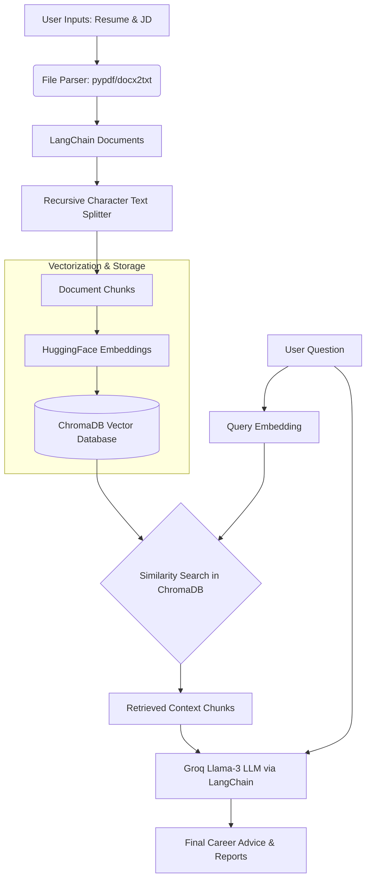

# ResumeIQ AI
## AI-Powered Resume Intelligence using Traditional RAG


## Project Overview

**ResumeIQ AI** is an end-to-end AI career coaching application designed to analyze resumes against job descriptions using a Traditional Retrieval-Augmented Generation (RAG) pipeline. Built with Python, Streamlit, LangChain, and Groq's high-speed Llama models, this application helps job seekers identify skill gaps, improve their resumes, and prepare for interviews based on highly contextual retrieved information. 

This project demonstrates strong proficiency in applied Generative AI, natural language processing, vector databases, and full-stack Python development.

---

## Features

- **Multi-format Document Parsing:** Upload Resumes and Job Descriptions in `.txt`, `.pdf`, or `.docx` formats.
- **Dynamic RAG Indexing:** On-the-fly chunking, embedding, and vector database generation customized to the user's specific career inputs.
- **Interactive Career Q&A:** Ask targeted questions about your resume's suitability for the role.
- **Comprehensive Career Reports:** Instantly generate detailed reports including:
  - Resume Match Summary
  - Strengths and Missing Skills Analysis
  - Project Recommendations to fill skill gaps
  - Targeted Interview Preparation Tips
- **Performance Optimized:** Features lazy-loading, Streamlit caching mechanisms, and batched HuggingFace embedding generation for lightning-fast startup and inference.
- **Source Transparency:** View the exact retrieved context (chunks) the LLM used to formulate its career advice.

---

## Technology Stack

- **Frontend & UI:** [Streamlit](https://streamlit.io/)
- **Orchestration:** [LangChain](https://python.langchain.com/)
- **Large Language Model (LLM):** [Groq](https://groq.com/) (Llama-3.1-8b-instant)
- **Embeddings:** [HuggingFace](https://huggingface.co/) (`sentence-transformers/all-MiniLM-L6-v2`)
- **Vector Database:** [ChromaDB](https://www.trychroma.com/) (In-Memory for maximum speed)
- **Document Processing:** `pypdf`, `docx2txt`

---

## Traditional RAG Pipeline

This application utilizes a strict, traditional RAG workflow to eliminate hallucinations and ensure the AI's advice is strictly grounded in the user's actual resume and the target job description:

1. **Document Loading:** The Resume and Job Description are parsed from files (PDF/DOCX/TXT) and converted into LangChain `Document` objects.
2. **Chunking:** The large text blocks are split into overlapping chunks using `RecursiveCharacterTextSplitter` to preserve semantic meaning.
3. **Embeddings:** Each text chunk is mathematically represented as a numerical vector using HuggingFace's `all-MiniLM-L6-v2` model.
4. **Chroma Vector Database:** The generated vectors and their corresponding text chunks are stored in an in-memory ChromaDB vector store.
5. **Similarity Search:** When a user asks a career question, the query is embedded, and ChromaDB performs a similarity search to retrieve the most relevant resume/JD chunks.
6. **Groq LLM Response Generation:** The retrieved context chunks and the user's question are injected into a highly specific prompt template. The Groq LLM generates the final career guidance strictly using the provided context.

---

## Project Architecture



---

## Folder Structure

```text
ResumeIQ-AI/
│
├── src/
│   ├── __init__.py
│   ├── file_utils.py        # Handles PDF, DOCX, and TXT parsing (Lazy-loaded)
│   └── rag_engine.py        # Core RAG pipeline, Embeddings, ChromaDB, and LLM Logic
│
├── app.py                   # Streamlit Frontend and Application State
├── requirements.txt         # Project Dependencies
├── .env                     # Environment Variables (Ignored in Git)
└── README.md                # Project Documentation
```

---

## Installation

### 1. Clone the Repository
```bash
git clone https://github.com/yourusername/ResumeIQ-AI.git
cd ResumeIQ-AI
```

### 2. Create a Virtual Environment
**Windows:**
```bash
python -m venv venv
venv\Scripts\activate
```

**Mac/Linux:**
```bash
python3 -m venv venv
source venv/bin/activate
```

### 3. Install Dependencies
```bash
pip install -r requirements.txt
```

---

## Environment Setup (.env)

The application requires a Groq API key for the LLM. 

1. Obtain a free API key from [Groq Console](https://console.groq.com/).
2. Create a `.env` file in the root directory.
3. Add the following line:

```env
GROQ_API_KEY=your_groq_api_key_here
```

---

## Running the Project

Run the Streamlit application using the following command:

```bash
streamlit run app.py
```

The application will launch in your default web browser at `http://localhost:8501`.

---

## Screenshots

*(Placeholder for Screenshots)*

> **Tip:** Add screenshots here showing the file upload interface, the generated career report, and the retrieved context expander to make the portfolio pop!

---

## Future Enhancements

The following features are planned for future iterations of ResumeIQ AI:
- **ATS Score:** A quantifiable scoring algorithm mimicking real-world Applicant Tracking Systems.
- **Resume Match Percentage:** A direct percentage score mapping the resume's skills to the JD's requirements.
- **Skill Gap Dashboard:** Visual charts and graphs representing missing competencies.
- **Personalized Learning Roadmap:** AI-generated weekly study plans to acquire missing skills.
- **Interview Question Generator:** Dynamic technical and behavioral questions based strictly on identified weak points.
- **PDF Career Report:** Downloadable offline reports for the user's records.

---

## Learning Outcomes

Building this project provided deep, hands-on experience with:
- **Retrieval-Augmented Generation (RAG):** Understanding the intricacies of chunking strategies, overlap, and context windows.
- **Vector Databases:** Working with ChromaDB for efficient semantic search.
- **Performance Optimization:** Implementing lazy loading, Python `time.perf_counter()` profiling, batched embedding generation, and Streamlit caching (`@st.cache_resource`) to reduce load times by over 80%.
- **Prompt Engineering:** Designing system prompts that force the LLM to strictly adhere to provided context, eliminating hallucinations.

---

## License

This project is licensed under the MIT License - see the LICENSE file for details.
